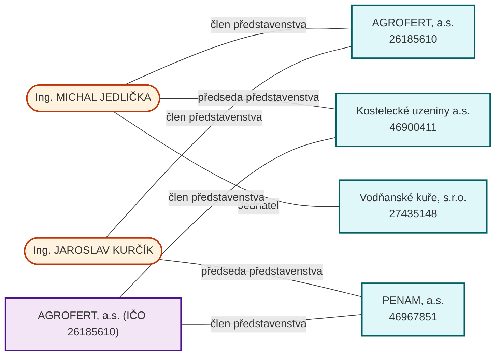

# ares-mcp

> **MCP server for ARES — the Czech business registry.** Validate IČO/DIČ, look up companies, statutory bodies, trade licenses and addresses directly from Claude Desktop, Claude Code, Cursor and any other MCP-compatible client.
>
> **Open-source (MIT), self-hosted.** Runs against the public ARES API — your queries never leave your machine. Optionally emits **Ed25519-signed, sourced answers** so anyone can verify their integrity and origin offline.
>
> **Hosted version:** [icovazby.cz](https://icovazby.cz/?utm_source=ares-mcp) — full web company-checks across 10+ Czech registers (ARES, Public Register, trade licenses, insolvency, sanctions, …).

ARES (Administrativní registr ekonomických subjektů) is the official public registry of Czech businesses, operated by the Czech Ministry of Finance (MFČR). This project is an **independent, community-built** MCP server that calls the public ARES REST API.

> **Not affiliated with the Czech Ministry of Finance.** This project is not affiliated with, endorsed by, or sponsored by MFČR or the ARES operator. "ARES" refers to the public information system; this MCP server is third-party software.

- **Free, MIT-licensed code.** No API key required (ARES is a public API).
- **14 stable tools** covering the full due-diligence + invoicing workflow: validation, lookup, structured search, **search-by-address** (virtual-office detection), statutory bodies, trade licenses, VAT check, address standardization, NACE lookup, **RES statistical classification** (size bracket, ESA 2010 sector), **insolvency check**, **cross-company person graph** with Mermaid + optional historical mode for nominee detection, a one-shot `ares_full_due_diligence` macro with 🟢🟡🔴 risk flag, and an **export adapter** that emits Fakturoid / iDoklad / Pohoda payloads ready to POST.
- **Two transports.** Stdio (default) for local AI clients, Streamable HTTP (`/mcp`) for remote / web deployment.
- **Verifiable provenance (optional).** With a signing key set, the due-diligence, statutory-bodies and insolvency tools return a signed envelope where every fact carries its registry source + date; verify it offline against the published JWKS. A *technical integrity & origin proof — not a qualified e-signature or an official extract.*
- **Defensive by design.** Rate-limit aware (token bucket + exponential backoff with `Retry-After`), per-IP request throttling on the HTTP variant, structured errors, no PII stored or logged by default.

---

## Setup

Three ways to run `ares-mcp` — pick one:

### Option A — npx (no install, recommended)

```json
{
  "mcpServers": {
    "ares": { "command": "npx", "args": ["-y", "@milos106/ares-mcp"] }
  }
}
```

### Option B — Docker (GHCR image)

```sh
docker run -i --rm ghcr.io/milos106/ares-mcp:0.1.0
```

```json
{
  "mcpServers": {
    "ares": { "command": "docker", "args": ["run", "-i", "--rm", "ghcr.io/milos106/ares-mcp:0.1.0"] }
  }
}
```

### Option C — from source

```sh
git clone git@github.com:milos106/ares-mcp.git
cd ares-mcp
npm install
npm run build
npm test
```

Then point your MCP client at the absolute path of `dist/index.js`. The per-client examples below use this from-source form — swap `"command": "node", "args": ["…/dist/index.js"]` for the npx or Docker form above if you prefer a zero-install setup.

### Claude Desktop

Edit your `claude_desktop_config.json`:

- macOS: `~/Library/Application Support/Claude/claude_desktop_config.json`
- Windows: `%APPDATA%\Claude\claude_desktop_config.json`
- Linux: `~/.config/Claude/claude_desktop_config.json`

```json
{
  "mcpServers": {
    "ares": {
      "command": "node",
      "args": ["/absolute/path/to/ares-mcp/dist/index.js"]
    }
  }
}
```

Restart Claude Desktop.

### Claude Code

```sh
claude mcp add ares -- node /absolute/path/to/ares-mcp/dist/index.js
```

### Cursor

In Cursor settings → MCP servers:

```json
{
  "ares": {
    "command": "node",
    "args": ["/absolute/path/to/ares-mcp/dist/index.js"]
  }
}
```

### Get ready-to-paste client config

After `npm run build`, this prints absolute-path config blocks for Claude Desktop, Cursor, Claude Code, and the local HTTP transport:

```sh
npm run config
```

Copy the JSON block straight into your client's MCP config — no path editing needed.

### Try it interactively with MCP Inspector

```sh
npm run inspector
```

(Equivalent to `npx @modelcontextprotocol/inspector node dist/index.js`.)

Opens a browser UI at `http://localhost:6274` where you can list tools, fill arguments, and run them against live ARES — no client configuration needed.

### Run as a local HTTP service

A second entry point exposes the same tools over MCP Streamable HTTP. Useful when sharing one running instance across multiple local clients.

```sh
PORT=3030 npm run start:http
```

Endpoints:
- `POST /mcp` — Streamable HTTP transport (JSON-RPC over HTTP / SSE)
- `GET  /healthz` — liveness + session count

Configuration via environment variables:

| Variable | Default | Description |
|---|---|---|
| `PORT` | `3030` | Listen port |
| `ARES_HTTP_RATE_LIMIT` | `60` | Per-IP requests per minute (token bucket) |
| `ARES_HTTP_MAX_BODY` | `1000000` | Max request body bytes |
| `ARES_HTTP_SESSION_TTL_MS` | `3600000` | Idle session timeout |
| `ARES_HTTP_ALLOW_ORIGIN` | _(unset)_ | If set, sent as `Access-Control-Allow-Origin` (e.g. `*` or `https://example.com`) |

There is **no built-in authentication** — bind it to `127.0.0.1` only or put a reverse proxy in front if you ever need to expose it.

---

## Tools

| Tool | Purpose |
|---|---|
| `ares_validate_ico` | Mod-11 checksum validation. No network call. |
| `ares_lookup_company` | Aggregated company profile by IČO. |
| `ares_search_companies` | Structured search by name, postcode, NACE, legal form. |
| `ares_get_statutory_bodies` | Directors, board, partners (from VR). |
| `ares_get_trade_licenses` | Trade licenses (from RŽP). |
| `ares_check_vat_payer` | VAT-payer status with optional DIČ cross-check. |
| `ares_standardize_address` | Canonicalize a free-form address via RÚIAN. |
| `ares_lookup_cz_nace` | CZ-NACE classification lookup. |
| `ares_cross_company_persons` | Given 2–50 IČOs, find persons who hold active statutory roles in two or more of them. Returns JSON + Mermaid graph. |
| `ares_search_by_address` | Find all entities at a given address. Flags virtual offices / shell-address concentrations. |
| `ares_get_res_classification` | Statistical classification from RES — size bracket, ESA 2010 sector, NUTS region. |
| `ares_check_insolvenci` | Fast red-flag: is the entity currently in insolvency proceedings (IR) or marked as bankrupt (CEÚ)? |
| `ares_full_due_diligence` | One-shot DD report — profile + statutary + licenses + VAT + insolvency + 🟢🟡🔴 risk flag + Markdown summary. |
| `ares_export_for_invoicing` | Transform an ARES profile into a Fakturoid / iDoklad / Pohoda payload ready for invoicing systems. Pure transformation — no calls to the target system. |

### Example prompts

> "Validate IČO 27074358 and tell me if it's a VAT payer and which region it's based in."

> "Find Czech IT companies (CZ-NACE 620) registered in Prague."

> "Who are the statutory directors of IČO 26168685? When were they appointed?"

> "Standardize this address: 'Za prachárnou 4962/45, Jihlava'."

> "Look up the CZ-NACE code for software development."

> "I have IČOs 26185610, 46967851, 46900411, 27435148. Are any people on the boards of more than one? Draw it."

> "Run a full due-diligence check on IČO 45193258 before I sign anything."

The DD prompt calls `ares_full_due_diligence` and returns a complete risk-flagged report. Real example (Liberty Ostrava a.s., captured 2026-06-07):

```
# Due diligence: Liberty Ostrava a.s.

Risk level: 🔴 RED

Findings:
- 🚨 Active insolvency or bankruptcy on record.

## Identification
- IČO: `45193258`
- DIČ: `CZ45193258` (VAT payer: yes)
- Legal form: 121
- Founded: 1992-01-22
- Registered seat: Vratimovská 689/117, Kunčice, 71900 Ostrava

## Governance
- Active statutary members: 3

## Insolvency
- Insolvenční rejstřík: ACTIVE
- Centrální evidence úpadců: NONE
- Currently insolvent.
```

The same prompt on a healthy company (AGROFERT IČO 26185610) yields 🟢 GREEN with 12 active statutary members and no findings.

The last prompt uses `ares_cross_company_persons`. The tool returns a Mermaid graph that Claude Desktop, Claude Code, and Cursor will render inline. On the Agrofert holding example above, the tool reports that *Michal Jedlička* sits on three of the four boards and *Jaroslav Kurčík* on two — a classic holding-group fingerprint.

### A note on person→companies search

ARES's public REST v3 API does **not** expose a search-by-person endpoint (the `AngazovanaOsobaFiltr` schema is defined but unused). `ares_cross_company_persons` therefore operates over a **known set** of IČOs that you provide — it does not enumerate the registry. Full reverse lookup ("which companies has Jan Novák ever sat on?") requires a mirrored graph database and is out of scope for this MIT-licensed server.

---

## Real example — the Agrofert holding

Run `ares_cross_company_persons` with four IČOs from the Agrofert group (AGROFERT itself + three subsidiaries) and the tool returns the full board overlap. Captured from a live ARES call on 2026-06-07:

```
zpracovanoIco: 4
totalActivePersons: 29
sharedCount: 3

  • Ing. MICHAL JEDLIČKA (1978-01-06)
       AGROFERT, a.s.            — člen představenstva
       Kostelecké uzeniny a.s.   — předseda představenstva
       Vodňanské kuře, s.r.o.    — Jednatel

  • Ing. JAROSLAV KURČÍK (1969-08-24)
       AGROFERT, a.s.            — člen představenstva
       PENAM, a.s.               — předseda představenstva

  • AGROFERT, a.s. (právnická osoba, IČO 26185610)
       PENAM, a.s.               — člen představenstva
       Kostelecké uzeniny a.s.   — člen představenstva
```

Rendered as Mermaid (Claude Desktop / Claude Code / Cursor render this inline):



The third connection — AGROFERT a.s. itself listed as a corporate director in two of its subsidiaries — is a real holding-company pattern that flat per-company listings miss but the graph helper surfaces automatically.

---

## Configuration

The server reads optional environment variables:

| Variable | Default | Description |
|---|---|---|
| `ARES_BASE_URL` | `https://ares.gov.cz/ekonomicke-subjekty-v-be/rest` | API base URL |
| `ARES_RATE_PER_SECOND` | `5` | Token-bucket budget. MFČR documents a ceiling of 500 req/min (~8 req/s); we default to 5 for headroom. Do not exceed 8. |
| `ARES_TIMEOUT_MS` | `15000` | Per-request timeout |
| `ARES_RETRIES` | `3` | Retry budget (on top of the initial attempt) for retriable errors |

---

## Error handling

Errors are returned as a JSON payload inside the tool result (with `isError: true`) so the agent can reason about them. Codes:

| Code | When |
|---|---|
| `NOT_FOUND` | The IČO or resource does not exist in ARES. |
| `INVALID_INPUT` | The input failed validation (e.g. IČO checksum, missing search filter). |
| `RATE_LIMITED` | ARES returned 429 and retries were exhausted. |
| `UPSTREAM_ERROR` | ARES returned 5xx. |
| `NETWORK_ERROR` | The request timed out or could not be sent. |

---

## Data attribution & license

ARES data is published by the **Czech Ministry of Finance** as open data under the **Creative Commons Attribution 4.0 (CC BY 4.0)** license. When using output from these tools in your own products, content, or analysis, you must attribute the source.

Suggested attribution string:

> Source: ARES — Administrativní registr ekonomických subjektů, © Ministerstvo financí ČR, [https://ares.gov.cz/](https://ares.gov.cz/), licensed under [CC BY 4.0](https://creativecommons.org/licenses/by/4.0/).

Each tool result includes an `_attribution` field with the full citation block for convenience.

The code of this MCP server is licensed under the MIT license (see [LICENSE](./LICENSE)); the upstream data license (CC BY 4.0) is independent of and unaffected by this code license.

## Acceptable use of the ARES API

The MFČR publishes operational rules for the ARES public API. **Using this MCP server does not exempt you from those rules** — your client must respect them. Summary:

- **Max 500 requests per minute** per user. Above that, MFČR reserves the right to block access.
- Do not run repeated malformed queries.
- Do not maintain excessive concurrent automated queries.
- Do not circumvent rate limits using multiple IP addresses.
- Do not perform random database crawling (e.g. mass IČO enumeration).
- Do not probe security boundaries.

This server enforces a default budget of 5 req/s (300/min) and exponential backoff. **You are responsible for staying inside the MFČR limits in aggregate**, especially if you run multiple instances.

Full operating conditions: [wwwinfo.mfcr.cz/ares/ares_podminky.html.cz](https://wwwinfo.mfcr.cz/ares/ares_podminky.html.cz).

## Disclaimers

- **Data is public, not authoritative for legal proceedings.** All information from ARES is, per MFČR, "pouze informativního charakteru" (informational only). For court use, obtain an official extract from the Public Register at [justice.cz](https://justice.cz).
- **VAT-payer status from ARES is up to 24h delayed.** The authoritative source is the MFČR VAT registry at [adisspr.mfcr.cz](https://adisspr.mfcr.cz). A future Premium tier may add a direct MFČR check.
- **GDPR.** ARES contains personal data of statutory representatives (names, dates of birth). Publication of this data rests on the public-task lawful basis (Article 6(1)(e) GDPR) for MFČR. If you process this data downstream — including by passing it to your own LLM, storing it, or showing it to end-users — **you are the controller** and must comply with GDPR yourself. This server does not log requests or store responses by default.

---

## Roadmap

- **v0.x (current):** 8 free MVP tools, MIT-licensed, npm-distributed.
- **Premium tier (planned):** `ares_subscribe_changes`, `ares_bulk_lookup`, `ares_due_diligence_report`, `ares_export_to_invoice_systems`.

---

## Contributing

Bug reports and PRs welcome. Run:

```sh
npm run lint
npm run typecheck
npm test
```

before submitting.

## Links

- [icovazby.cz — hosted company checks](https://icovazby.cz/?utm_source=ares-mcp)
- [ARES portal](https://ares.gov.cz/)
- [ARES OpenAPI spec](https://ares.gov.cz/ekonomicke-subjekty-v-be/rest/v3/api-docs)
- [ARES Swagger UI](https://ares.gov.cz/swagger-ui/)
- [Model Context Protocol](https://modelcontextprotocol.io/)
- [MCP TypeScript SDK](https://github.com/modelcontextprotocol/typescript-sdk)

## License

MIT © Miloš Pospíšil
